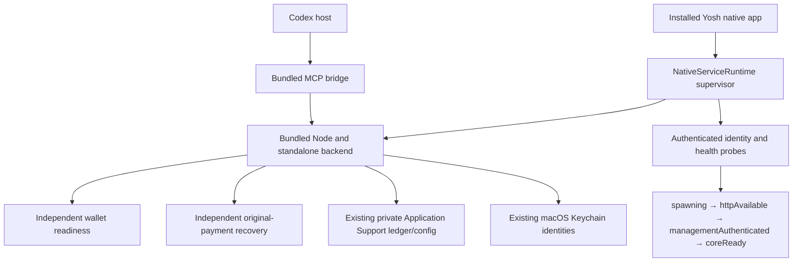

# Yosh installed runtime and startup supervision

2026-10-07–08 · arm64 macOS · installed `/Users/irin/Applications/Yosh.app`

## Delivery status

The runtime and lifecycle changes are implemented, built and installed. **The zero-prompt/distribution requirement is not complete.** The user reported 4 macOS password prompts at the first installation check, 4 on the subsequent cold launch, and approximately 4–5 on the last cold launch. No Keychain ACL, partition list, accessibility policy, wallet item or password was modified by this implementation. No purchase or transaction was performed.

There are no valid signing identities on this Mac (`security find-identity -v -p codesigning`: 0). The installed build is ad hoc signed; it is not a Developer ID signed/notarized distribution release.

## Old architecture and demonstrated weakness

- Native Yosh depended on repository/build paths, development Next output and an external Node installation. The MCP command used the source script and tsx loader.
- A single roughly 10-second startup window conflated process startup, management/core readiness and expensive initialization. Failure stopped the child with `notReady`.
- Child stdout/stderr were discarded. The historical timeout cannot retrospectively prove which operation originally blocked.
- A remembered startup failure could prevent useful automatic retries. A child exit required manual recovery.
- Normal shutdown/startup invalidated connection descriptors and grants, leaving configuration and backend access out of agreement.

The new installation check exposed and reproduced a separate exact configuration-order bug: the existing installation saved `live_mainnet` and retained production enablement, but the backend initially validated the default simulated environment before loading its persisted selection. This produced `CORE_CONFIGURATION_INVALID` / `INVALID_PAYMENT_ENVIRONMENT: production execution mode`. A regression first failed on the old order, then passed after resolving the persisted active profile before validation. The operator flag is retained as policy and applied only to a Mainnet profile; test profiles do not inherit production execution permission. Payment-environment validation remains intact.

## Product architecture

### Runtime packaging and configuration

- `Contents/MacOS/YoshBackendNode`: official Node 24.21.0 LTS, architecture-specific, verified against the official checksum. The arm64 executable links only macOS system libraries.
- `Contents/Resources/Runtime/backend`: Next standalone server, traced runtime dependencies, static assets and public assets; no repository, dotenv files or tsx dependency.
- `Contents/Resources/Runtime/mcp.cjs`: bundled MCP bridge. The owned Codex entry now points to this file and the installed Node executable.
- Node's license is included. The runtime occupies an approximately 182 MB application bundle on this Mac, with the standalone backend about 60 MB.
- Child environment is a whitelist, rather than inherited developer configuration. Product settings use a private, owner-checked regular `product-configuration.json` file in Application Support. The canonical installer imports only the existing Mainnet resource registration, production gate, optional public-wallet assertion and RPC setting once. It does not import private keys or arbitrary dotenv values, and preserves an existing product configuration.
- Existing users retain `Application Support/2049` when its ledger exists; fresh native installations select `Application Support/Yosh`. This avoids silently splitting an existing ledger. Keychain lookup identities remain unchanged.
- Mutable ledger/configuration/logs are outside the signed bundle. Disk-backed ISR and image optimization are disabled. Codesign verification and installed/build file digests remained valid after real execution.

An unrelated manually configured `2049-research` MCP entry still points to development tools. Yosh did not adopt or overwrite that unowned entry. This is not a runtime dependency of the installed App or the owned packaged Codex entry.

### Startup, monitoring and recovery

- Coalesced startup shares one child and one validated management credential in memory.
- Signed health proves Yosh service identity, expected PID/data directory, management authentication and local core availability. It does not await wallet Keychain, balance/RPC, recovery completion or Codex configuration migration.
- Wallet state: `walletChecking`, `walletAvailable`, `walletUnavailable`. Recovery state: `recoveryPending`, `recoveryRunning`, `recoveryComplete`.
- Initial observation is 45 seconds; progress extends observation by 45 seconds up to a 90-second observation deadline. A live child is retained after timeout and observed again after 5 seconds. Readiness timeout does not kill it.
- Probe failures receive safe classifications. Configuration, authentication, ownership and data-directory conflicts stop automatic spawning rather than looping.
- Unexpected exits restart with 1/2/4/8/16-second backoff, at most five restarts in five minutes. UI polling shares the scheduled recovery and cannot bypass its limit.
- The native singleton lock, authenticated stale-process takeover, PID/data-directory identity and SQLite data-directory owner lock remain. An unrelated listener is never killed.
- Native quit cancels supervision, requests authenticated backend drain, and verifies process exit plus port release. A failed drain keeps the App alive; it does not force-stop an active signer. A core configuration failure can still be shut down through the authenticated lifecycle endpoint.

### Diagnostics

`~/Library/Application Support/Yosh/Logs/backend-lifecycle.jsonl` and one rotated previous file store fixed operational labels only. Directory mode 0700; files 0600. Files rotate at approximately 1 MB, retaining about 2 MB total. Symlinks and non-owner files are rejected for logging.

Child streams are consumed and classified, not saved verbatim. Logs contain timestamp, phase, PID, error/HTTP code, startup duration and restart/exit facts. Raw environment, credentials, HMAC material, wallet secrets, upstream exceptions and authorization payloads are not persisted. A test secret printed by the child fixture is absent from persisted diagnostics.

## Keychain findings

| Item | Service / account | Current use |
| --- | --- | --- |
| Management | `com.twentyfortynine.backend-management.v1` / `local-installation` | One successful load per native process; child recovery reuses it. Denied loads have a 30-second cooldown; explicit retry is available. |
| App Lock | `com.twentyfortynine.yosh-app-lock.v1` / `local-app-lock` | Existing native store; already loaded state is retained for the native session. |
| Mainnet | `com.yosh.wallet.mainnet.v1` / `consumer-wallet-mainnet-v1` | Read existing protected material, retain public identity only for status; signer separately revalidates protected material for an actual payment. |
| Devnet/test | `com.2049.wallet.v1` / `consumer-wallet-v1` | One shared public inventory read to preserve the existing Mainnet/test signer-isolation check and the two-wallet Settings view. No repeated reads for healthy cached status. |

There is no legacy Demo wallet lookup in this Mainnet launch path, and no wallet creation/replacement on Mainnet startup. Successful status reads cache public information, not private signing material; failed wallet checks are throttled. Connection and Authority reads share the inventory.

A read-only, no-password-data ACL inspection found:

- Management trusts old `2049.app` paths and temporary/debug executables. Its partition list contains nine old `cdhash` identities.
- App Lock trusts the old installed `2049.app` and one old `cdhash`.
- The current installed native designated requirement is a different ad hoc `cdhash`; it is absent from those lists. This proves an existing native trust mismatch, including on subsequent launches of the unchanged current bundle.
- Both wallet items trust `/usr/bin/security` with `apple-tool:` partitions. The available evidence does not assign every reported prompt to an exact item; Computer Use is forbidden from inspecting SecurityAgent windows. No claim that signing alone will eliminate every wallet prompt is justified yet.

The installer supports `YOSH_CODESIGN_IDENTITY` for a real identity, hardened runtime and timestamp, with `allow-jit` limited to the bundled Node executable. Final release work requires Apple Developer credentials, signing all distributed executable components, notarization/stapling, legitimate system reauthorization of existing items where needed, and repeated cold-launch verification. Do not add broad trusted applications, loosen partition lists, or replace old wallet secrets to suppress prompts. Zero prompts must be measured on that release, not inferred from the current ad hoc build.

## Connection behavior

- Verified descriptors survive ordinary close/quit/restart; volatile host leases reset.
- The MCP bridge captures one capability, requires real host ping evidence, and reconnects with a fresh volatile session after temporary backend loss. It does not reload rotated/revoked credentials or retry a purchase.
- Explicit disconnect, member revocation and grant-driven credential rotation retain their existing security behavior. Normal lifecycle events do not revoke grants.
- Owned source-based Codex commands migrate through the existing receipt/journal checks to the installed runtime, including same-name path changes. Unowned config is preserved.
- At this installation's migration boundary the old shutdown had already removed its descriptor. One native Connect restored the existing owned integration; no grant was created, unpaused or renewed. Subsequent tested backend/App restarts preserved the descriptor byte-for-byte and required no Connect or credential repair.
- The pre-update desktop transport initially reported `Transport closed`. At final verification the actual desktop connector's `get_spending_status` succeeded again and returned the same Mainnet public identity; no manual config or credential repair was performed. Normal restart recovery was also verified with a continuously running real Codex host using the packaged bridge.

## Verification evidence

| Check | Actual result |
| --- | --- |
| Backend full suite with bundled Node 24 | 62 files, **748 tests passed**. Includes original payment/authentication/replay/recovery tests and real Codex-host restart coverage. |
| Typecheck / lint / production Next build | Passed. |
| Native Release / canonical installer | Passed; installed at the canonical path; 1,545 installed/build file digests equal; strict deep codesign verification passed. |
| Native launch configuration | Packaged-only paths, sanitized child environment, private configuration mode/owner/symlink/key checks passed. |
| Native management security/lifecycle | Signed proof, tamper/status/nonce rejection, bounded streams/timeouts, preserved unrelated listener, real-backend shutdown/stale replacement, delayed startup, automatic restart and bounded persistent crash loop passed. |
| Native management/member smoke | Passed. |
| Delayed service fixtures | Listener and core delays of 12 seconds exceed the old timeout without child termination; wallet/recovery remain independent. |
| Successful installed cold launch 1 | App 34263, backend 34281: spawn 23:50:24 → core ready 23:50:25. Wallet available 23:52:49, more than two minutes later; backend stayed alive. |
| One intentional owned backend termination | No pending/unknown purchases; PID 34281 terminated once with SIGTERM. PID 34580 became core ready approximately two seconds later. Same native App, same descriptor and wallet identity; UI returned to Connected. |
| Successful installed cold launch 2 | App 34652, backend 34675: core ready 00:00:21. Normal preceding quit released the listener. Real host/status recovered without config reload. User reports 4 system password entries. |
| Successful installed cold launch 3 | App 34739, backend 34753: core ready 00:02:14. A macOS sandbox denied all reads under the repository and `/opt/homebrew`; a control repository read returned `Operation not permitted`. App/backend and the packaged real-host MCP read succeeded. User reports approximately 4–5 prompts. |
| Duplicate launch | Second native launch exited; original App and one loopback listener remained. |
| Installed paths | Backend cwd/executable inside installed bundle; data under existing Application Support. No external bundle symlinks or dotenv files. |
| Actual MCP | Real Codex CLI app-server host, no model turn, only `get_spending_status`; UI Connected after automatic restart and both subsequent App launches. The actual desktop connector also returned a successful read at final verification. |
| Financial state | All eight snapshotted data tables unchanged: app settings, monetary controls, grants, members, resources, purchases, original payments and signatures. 9 grants, 14 purchases, 3 resources. |
| Wallet preservation | Same public Mainnet identity (suffix `jTRXRC`) across installed reads, child recovery and App relaunches. Original Mainnet/test Keychain item creation/modification timestamps remain before this work; no wallet writes were performed. No separate pre-change public-address snapshot was available, so this is preserved-item plus runtime-identity evidence, not a claimed secret comparison. |

Times above are Asia/Shanghai, Oct 7–8. Local build/test logs live in excluded `build.noindex/product-*.log`; operational logs are in the private Application Support directory. The optional `tests/native/installed-product-smoke.mjs` uses an isolated temporary host configuration and never sends a purchase/model request.

## Remaining release gate

The payment kernel/x402 executor, integer/atomic accounting, Mainnet safety gates, dedicated wallet identity, original-payment recovery and delivery-recovery semantics were not redesigned. Startup, configuration projection, supervision, status caching and MCP transport lifecycle were sufficient for these repairs.

The remaining proven product failure is repeated system authorization: **4, 4, approximately 4–5 prompts**. Stable Developer ID signing/notarization and existing-item authorization validation are required before describing Yosh as a finished zero-prompt distributable product. This installation has a working supervised packaged backend, but it does not yet meet that release standard.
